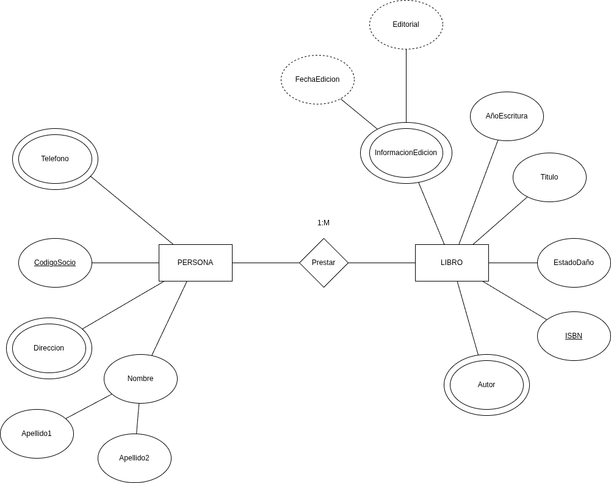

## Contexto del ejercicio

Se requiere diseñar la base de datos para las operaciones de una **biblioteca comunitaria local**. La biblioteca tiene libros, CD, cintas, etc., que se prestan a diferentes usuarios.

Los **usuarios** cuentan con un número de cuenta único, direcciones, números telefónicos y fecha de nacimiento, entre otros datos. Si un artículo prestado está vencido (fuera de la fecha límite de entrega), el usuario acumula una penalización.

Algunos usuarios son **menores de edad** (menores a 18 años), por lo que deben tener **patrocinadores** que sean responsables de pagar las multas o de reemplazar un artículo en caso de pérdida.

## Diagrama

