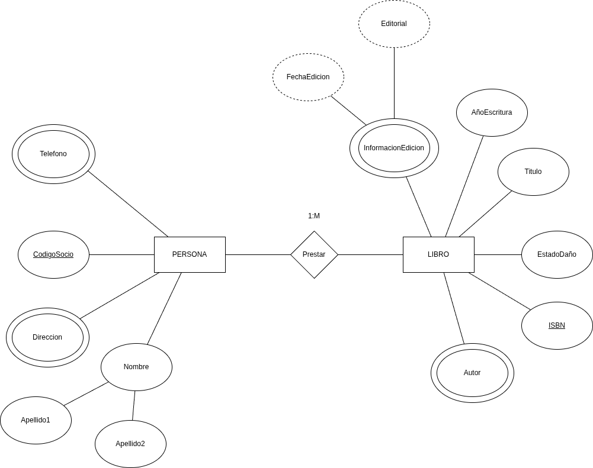
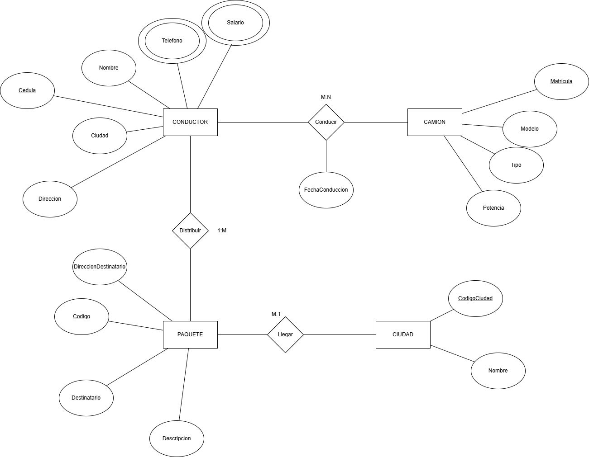

---
title: Ejercicio de Identificación de Entidades
excerpt: Evidencia práctica sobre la identificación de entidades y atributos a partir de un caso de negocio.
publishDate: '2026-02-20'
---

El objetivo es demostrar la correcta abstracción del dominio antes de pasar al diseño lógico.

