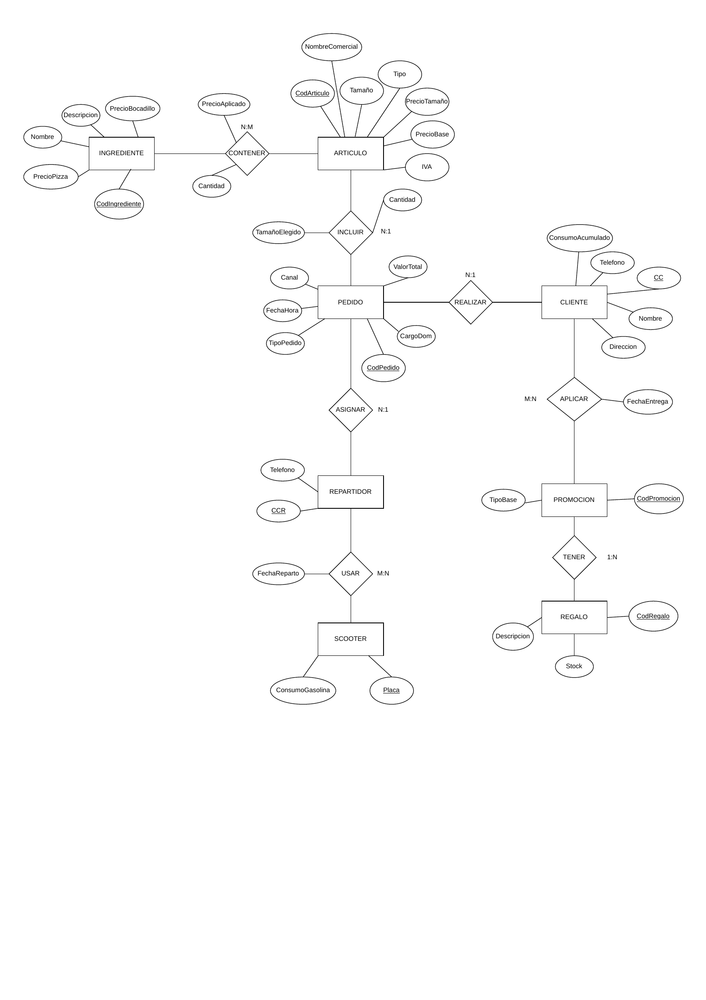

## Contexto del ejercicio

**Eat'n Go** es una empresa internacional de comidas rápidas que requiere informatizar su gestión. Vende pizzas, bocadillos y productos complementarios (refrescos, helados, etc.), con tres modalidades de pedido: consumo en local, para recoger y a domicilio.

El modelo contempla las siguientes entidades principales:

- **ARTICULO**: representa pizzas, bocadillos y productos complementarios. Tiene `CodArticulo`, `Tipo`, `Tamaño`, `PrecioBase`, `PrecioTamaño`, `IVA` y `NombreComercial` (para artículos "estrella").
- **INGREDIENTE**: identificado por `CodIngrediente`, con `Nombre`, `Descripcion`, `PrecioBocadillo` y `PrecioPizza`.
- **PEDIDO**: identificado por `CodPedido`, con `FechaHora`, `TipoPedido`, `Canal`, `CargoDom` y `ValorTotal`.
- **CLIENTE**: identificado por `CC`, con `Nombre`, `Direccion`, `Telefono` y `ConsumoAcumulado`.
- **REPARTIDOR**: identificado por `CCR`, con `Telefono`.
- **SCOOTER**: identificado por `Placa`, con `ConsumoGasolina`.
- **PROMOCION**: identificada por `CodPromocion`, con `TipoBase`.
- **REGALO**: identificado por `CodRegalo`, con `Descripcion` y `Stock`.

### Relaciones principales

| Relación | Entidades | Cardinalidad |
|---|---|---|
| CONTENER | ARTICULO – INGREDIENTE | N:M (con `Cantidad`, `PrecioAplicado`) |
| INCLUIR | PEDIDO – ARTICULO | N:1 (con `Cantidad`, `TamañoElegido`) |
| REALIZAR | PEDIDO – CLIENTE | N:1 |
| ASIGNAR | PEDIDO – REPARTIDOR | N:1 |
| USAR | REPARTIDOR – SCOOTER | M:N (con `FechaReparto`) |
| APLICAR | CLIENTE – PROMOCION | M:N (con `FechaEntrega`) |
| TENER | PROMOCION – REGALO | 1:N |

## Diagrama ER

