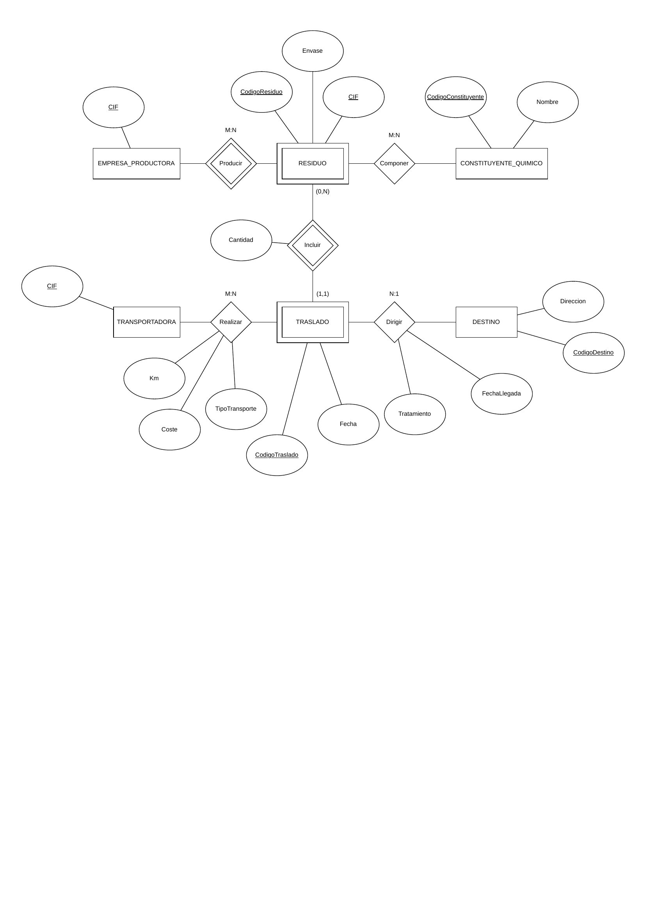

## Contexto del ejercicio

Se desea abordar la problemática ambiental de los **residuos tóxicos y peligrosos** cuya incorrecta gestión produce daños de gran importancia en el medio ambiente y en la salud del ser humano.

La información contempla desde que el residuo es producido por una empresa productora hasta que llega a un lugar seguro donde recibe tratamiento (incineración, almacenamiento en depósitos de seguridad, etc.).

### Entidades y atributos

- **EMPRESA_PRODUCTORA**: identificada por `CIF`.
- **RESIDUO**: identificado por `CodigoResiduo` y `CIF` de la empresa que lo produce. Registra el `Envase` definido para su traslado.
- **CONSTITUYENTE_QUIMICO**: identificado por `CodigoConstituyente`, con `Nombre`.
- **TRASLADO**: identificado por `CodigoTraslado`, con `Fecha` y `Tratamiento`.
- **TRANSPORTADORA**: identificada por `CIF`.
- **DESTINO**: identificado por `CodigoDestino`, con `Direccion` y `FechaLlegada`.

### Relaciones

| Relación | Entidades | Cardinalidad |
|---|---|---|
| Producir | EMPRESA_PRODUCTORA – RESIDUO | M:N |
| Componer | RESIDUO – CONSTITUYENTE_QUIMICO | M:N |
| Incluir | RESIDUO – TRASLADO | (0,N) – (1,1) con atributo `Cantidad` |
| Realizar | TRANSPORTADORA – TRASLADO | M:N (con `Km`, `Coste`, `TipoTransporte`) |
| Dirigir | TRASLADO – DESTINO | N:1 |

## Diagrama ER

