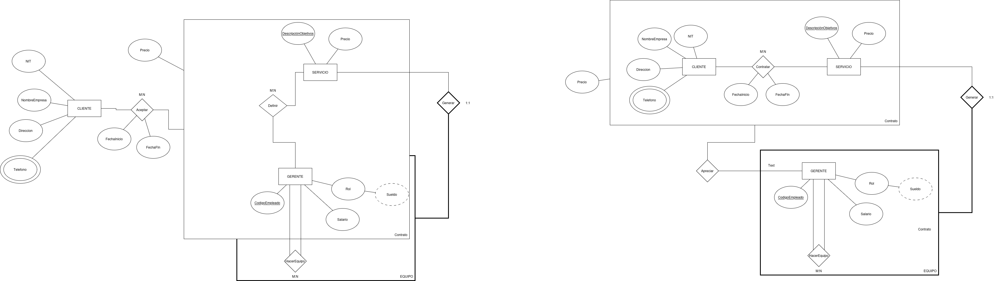

## Contexto del ejercicio

La empresa de servicios tecnológicos **"Soluciones Innova"** ha decidido modernizar su sistema de gestión interno. Se encarga el desarrollo de un nuevo sistema de información con las siguientes especificaciones:

- **Clientes corporativos**: se registra nombre de empresa, dirección, NIT y múltiples números de teléfono de contacto.
- **Servicios**: pueden ser contratados por uno o varios clientes. El precio lo define el gerente de proyecto para cada contrato en particular. Cada servicio tiene un costo interno independiente y una descripción de sus objetivos principales.
- **Contratos**: registran las fechas de inicio y finalización planificadas, y el precio pactado para ese contrato específico.
- **Gerentes de proyecto**: identificados por un código de empleado. Tienen un salario fijo (que puede diferir del sueldo recomendado para su rango profesional) y un nombre. Cada gerente puede tener un superior directo de rango inmediatamente más alto.
- **Equipos de proyecto**: formados por varios gerentes que mantienen su independencia y pueden participar en varios equipos en paralelo. Si un servicio se cancela, el equipo deja de existir, pero los gerentes continúan en la base de datos.

## Diagrama

