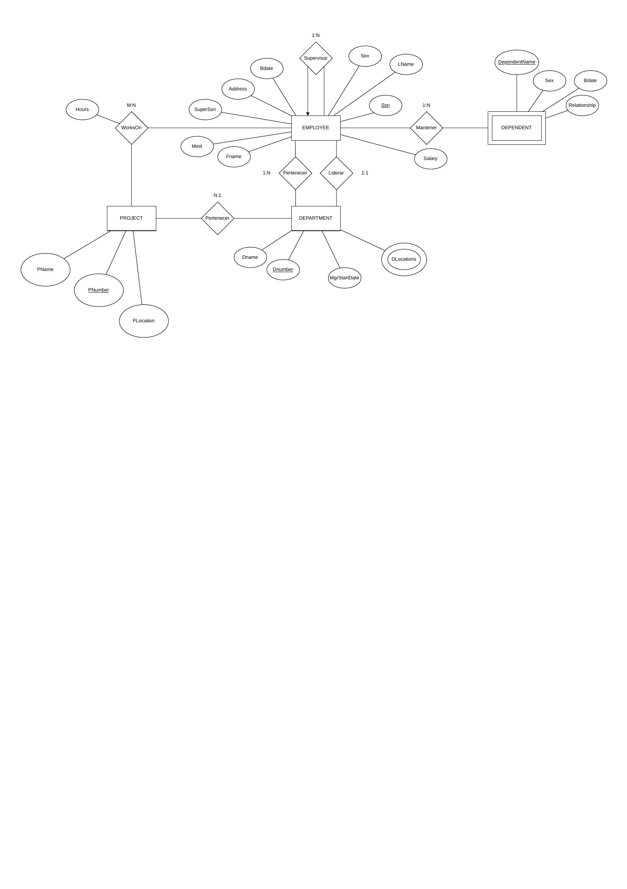

## Contexto del ejercicio

Este modelo es el resultado de aplicar **ingeniería inversa** a un diagrama de datos presentado en clase. El ejercicio consistió en analizar la estructura de un modelo existente e identificar manualmente sus entidades, atributos, relaciones y cardinalidades para reconstruirlo en notación Peter Chen usando draw.io.

El modelo reconstruido representa la gestión interna de una empresa con las siguientes entidades:

- **EMPLOYEE**: empleado identificado por su `Ssn`, con atributos como `Fname`, `Minit`, `LName`, `Bdate`, `Address`, `Sex`, `Salary` y `SuperSsn` (referencia al supervisor).
- **DEPARTMENT**: departamento identificado por `Dnumber`, con `Dname`, `DLocations` (multivaluado) y `MgrStartDate`.
- **PROJECT**: proyecto identificado por `PNumber`, con `PName` y `PLocation`.
- **DEPENDENT**: dependiente de un empleado, identificado compuestamente por `DependentName`, con `Sex`, `Bdate` y `Relationship`.

### Relaciones identificadas

| Relación | Entidades | Cardinalidad |
|---|---|---|
| Supervisar | EMPLOYEE – EMPLOYEE | 1:N |
| Pertenecer | EMPLOYEE – DEPARTMENT | N:1 |
| Liderar | EMPLOYEE – DEPARTMENT | 1:1 |
| WorksOn | EMPLOYEE – PROJECT | M:N (con atributo `Hours`) |
| Pertenecer | PROJECT – DEPARTMENT | N:1 |
| Mantener | EMPLOYEE – DEPENDENT | 1:N |

## Diagrama ER

