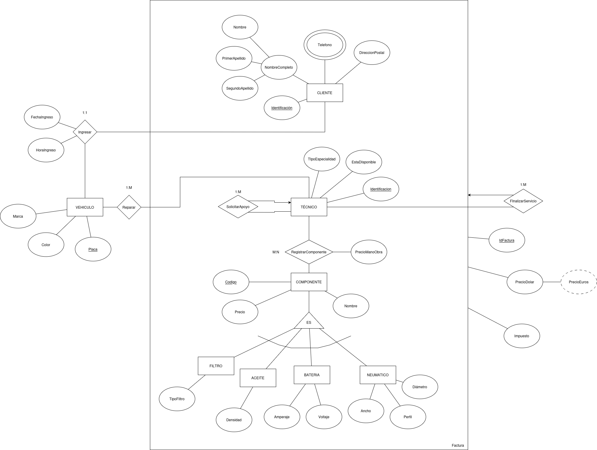

## Contexto del ejercicio

En el estacionamiento de la Universidad El Bosque se piensa implementar un espacio para la reparación de vehículos de los estudiantes, profesores y visitantes al centro médico Los Cobos. La idea es implementar una solución tecnológica; como Ingenieros de datos, se ha encargado diseñar el modelo de datos de una base de datos relacional que maneja la información de clientes, automóviles atendidos, técnicos especializados y los componentes usados en cada servicio.

### Proceso de servicio

1. Al llegar al taller se registran los datos del **propietario** (número de identificación, nombre completo, dirección postal, teléfono) y de su **automóvil** (placa, marca, color), junto con la fecha y hora de ingreso.
2. Tras el registro, se asigna un **técnico principal** disponible para realizar el diagnóstico de los daños.
3. El técnico principal puede solicitar el apoyo de otros **especialistas** para asistirlo en la reparación.
4. Los técnicos que participan registran en una **orden de trabajo** los componentes utilizados y el costo de la mano de obra.
5. Al finalizar, la orden de trabajo pasa al área de administración para generar la **factura**, que incluye: información del cliente, datos del técnico, desglose de componentes (con precio unitario), costo de mano de obra, impuesto del 21 % y el total en USD y EUR.
6. Todos los **componentes** comparten código, nombre y precio, pero se diferencian en categorías con atributos propios:
   - **Aceites**: densidad.
   - **Filtros**: tipo (aire, aceite, combustible).
   - **Baterías**: amperaje y voltaje.
   - **Neumáticos**: ancho, perfil y diámetro.

---

## Diagrama EER

> 📌 **Reemplaza la imagen y el enlace a continuación con los de tu diagrama real.**

🔗 [Ver diagrama en draw.io](https://ENLACE-DEL-DIAGRAMA-AQUI)

---

## Justificación del diseño

*(Agrega aquí la justificación de las decisiones de modelado tomadas por el grupo.)*
