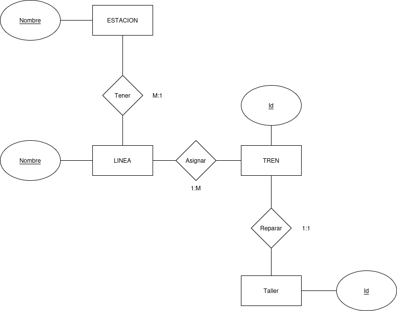

## Contexto del ejercicio

Se requiere diseñar la base de datos para la **gestión operativa del Sistema de Metro de Bogotá**, asumiendo que ya cuenta con varias líneas en pleno funcionamiento.

### Requisitos del sistema

- **Estructura de Líneas**: una línea se compone de estaciones en un orden secuencial, y es crucial registrar esta secuencia para la operación.
- **Conectividad de Estaciones**: cada estación pertenece a al menos una línea. Las estaciones de transferencia (como Calle 72 o el Portal de las Américas) pueden pertenecer a varias líneas. Una vez asignada a una línea, esta pertenencia es **permanente e inmutable**.
- **Gestión de Accesos**: cada estación puede tener múltiples accesos (escaleras, ascensores, etc.). Un acceso está vinculado exclusivamente a una única estación y esta asignación es **inmutable**.
- **Flota de Trenes**: cada línea tiene asignada su propia flota. Un tren puede estar asignado a una sola línea a la vez, o puede estar en mantenimiento sin pertenecer a ninguna. La cantidad de trenes por línea debe ser **mínimo igual** al número de estaciones de esa línea y **máximo el doble** de dicho número.
- **Patio de Mantenimiento**: el sistema tiene varios patios. Cada tren debe tener un patio asignado para su resguardo en todo momento (obligatorio). Un tren puede ser reasignado a un patio diferente.
- **Necesidades de Información**: el sistema debe permitir consultar todos los accesos disponibles para los pasajeros en cada línea del metro.

---

## Diagrama ER

> 📌 **Reemplaza la imagen y el enlace a continuación con los de tu diagrama real.**

🔗 [Ver diagrama en draw.io](https://ENLACE-DEL-DIAGRAMA-AQUI)

---

## Justificación del diseño

*(Agrega aquí la justificación de las decisiones de modelado tomadas por el grupo.)*
